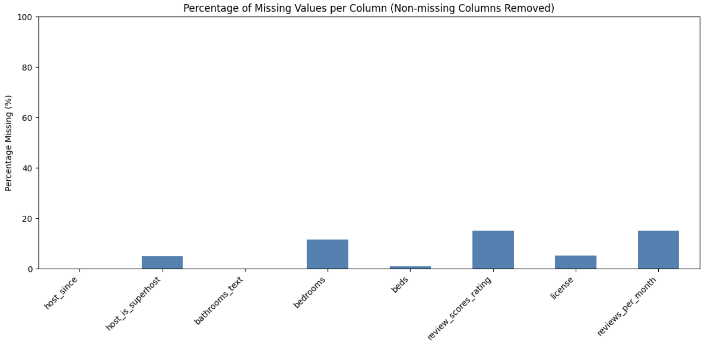
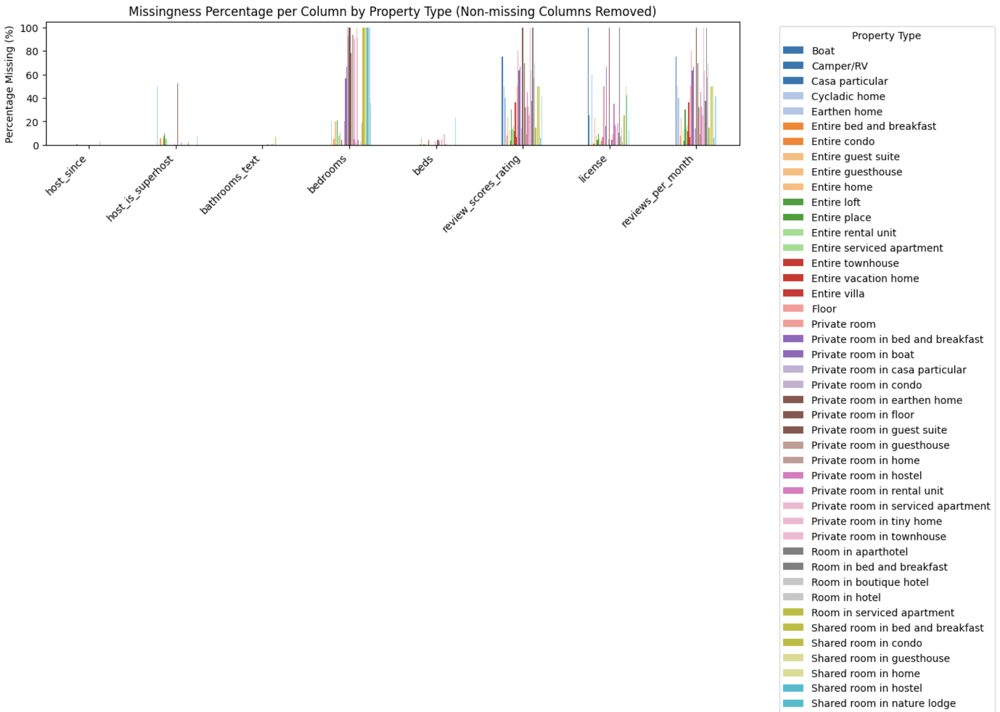
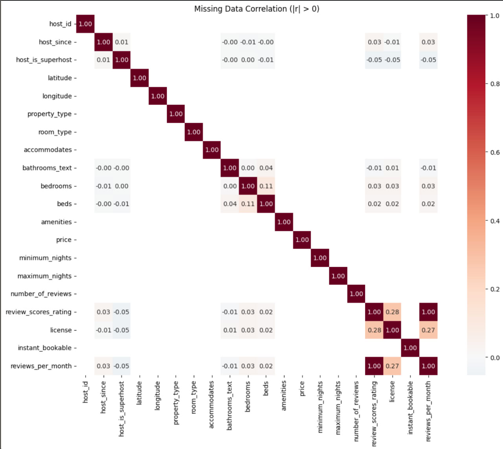
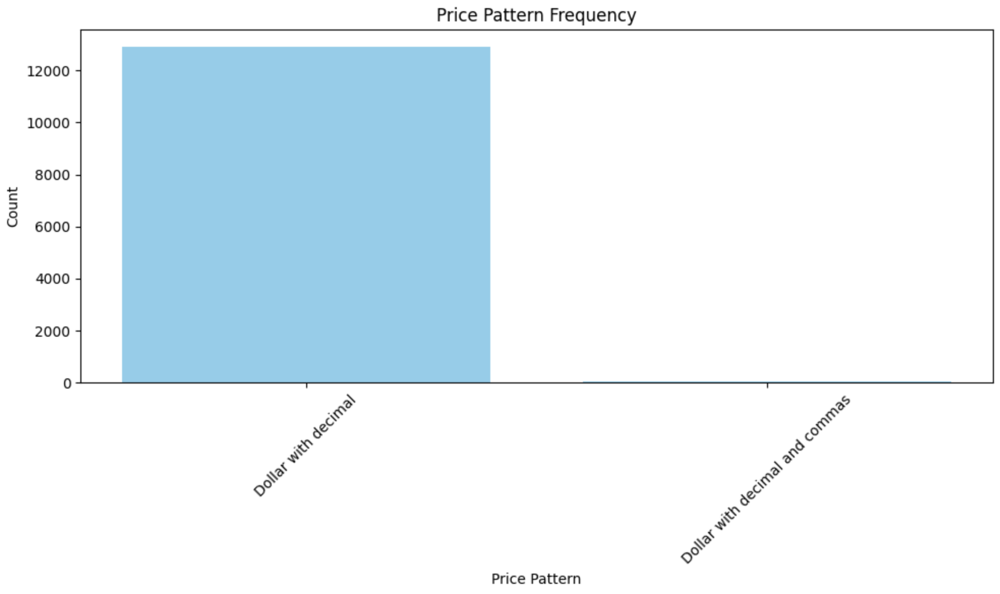

# Homework-2

Team: 18-22\
Authors:\
- Mykhailo Buleshnyi\
- Maksym Buleshnyi\
- Artur Pelcharskiy\
- Davyd Ilnytskyi\

# Missing Data Visualization Report

Handling missing data is a critical step in any data analysis or machine learning pipeline. Airbnb listing datasets often contain missing values due to various reasons, such as incomplete user inputs or inconsistent data collection. This report outlines the methodology for diagnosing and visualizing missing data patterns, enabling better understanding and informed decisions for data cleaning and imputation.

## 2. Motivation

Visualizing missingness addresses several key questions:

- Extent of missing data: Which columns contain missing values and what proportion of data is affected?
- Pattern identification: Are missing values randomly distributed, or do they exhibit systematic patterns (e.g., clustered in specific columns or categories)?
- Group-wise missingness: Does missingness vary across subpopulations (e.g., different property types)?
- Co-occurrence of missingness: Are certain columns missing together, indicating dependencies?

## 3. Approaches used and Motivation behind them

First of all columns with no variability (e.g., the `bathrooms` column, entirely missing) were excluded from analyses to avoid noise and improve clarity. This step emphasizes the importance of preliminary data audits.

### 3.1 Missing Percentage Per Column

A bar chart of missing value percentages per column (filtered to columns with missing data) offers a straightforward overview of data completeness. Columns are ordered by descending missingness, focusing attention on problematic fields. This summary informs whether to exclude certain features or apply imputation.

### 3.2 Grouped Missingness by Property Type

By segmenting missingness according to the `property_type` categorical variable, it is possible to detect whether specific types of properties have more missing data in particular columns. We chose to create this bar plot because our preliminary data analysis revealed that the extent of missing data varies significantly across different Property Types. 

### 3.3 Correlation of Missingness Across Columns

Missingness indicators (1 if data present, 0 if missing) were created for each column. Pairwise Pearson correlation coefficients between these indicators reveal columns whose missingness co-occurs frequently. This insight is critical when deciding on imputation strategies that handle multiple columns simultaneously.

### 3.4 Price Format Pattern Analysis

Addtionaly we analyzed `price` column. Price data was analyzed for format consistency by classifying values into regex-based patterns such as:

- Dollar sign with decimals and commas (e.g., `$5,000.00`)
- Dollar sign with decimals (e.g., `$150.00`)
- Numeric only with decimals or without

Visualization of pattern frequencies confirmed that price data is consistently recorded in dollar amounts with a limited set of formats, ensuring reliability of this key feature.

This easially allows to show how can we parse those results. If all results are consistent having the same pattern it can be easily parsed and

## 4. Limitations and Considerations

- Definition of missingness: The approach considers both `null` values and empty strings as missing for string columns, which may not capture all forms of invalid data (e.g., placeholders like `"N/A"`).
- Data size and scalability: Conversion from Spark DataFrames to Pandas for plotting is efficient for moderate data sizes but may not scale to very large datasets without sampling or aggregation.
- Static plots: While informative, static visualizations limit interactive exploration, which can be valuable for complex datasets.
- Correlation interpretation:*Correlation between missingness flags indicates association but does not explain causality or mechanisms behind missing data.
- Group sizes: Missingness statistics for groups with small sample sizes may be unstable or misleading.

---

## 6. Conclusion

The combination of descriptive statistics and targeted visualizations offers a comprehensive view of missing data in Airbnb listings. Identifying missing data patterns, group-level variations, and inter-column dependencies enables more informed data cleaning and imputation decisions, ultimately improving model reliability and insights drawn from the data.

